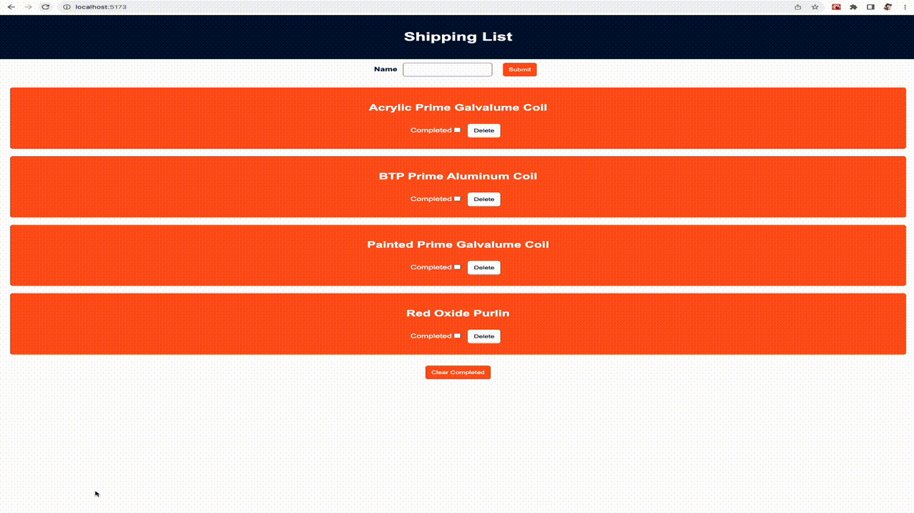

# react-assessment

## Building and Running Environment

First install dependencies:

```sh
npm i
```

To run react application:

```sh
npm run dev
```
## Challenges

I was planning to tackle the bonus materials, but I my code broke when I moved the item logic from the ItemsList component to the App component. It took quite a bit of time to get the "mark checked" functionality working again. I had intended to use the Fetch API to handle changes to the data.json file whenever items were modified, but unfortunately, I ran out of time to implement that.

## Demo

